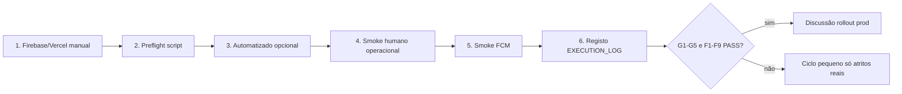

# Runbook — Validação operacional real (staging)

> **Modo oficial:** [MODO_VALIDACAO_OPERACIONAL_HUMANA.md](./MODO_VALIDACAO_OPERACIONAL_HUMANA.md)  
> **Registo obrigatório:** [STAGING_VALIDATION_EXECUTION_LOG.md](./STAGING_VALIDATION_EXECUTION_LOG.md)  
> Produção e `main` bloqueados até primeiro PASS completo no log.

---

## Critério “MVP operacional pronto”

Uma corrida completa em **staging**, com os **3 papéis**, **sem workaround crítico**:

| Papel | Fecha |
|-------|--------|
| Operador | Cria/aprova/despacha (agenda, não UUID console) |
| Motorista | Aceita → estados → **finalizada** (+ push ou fallback documentado) |
| Cliente | Consulta lista + detalhe + timeline coerente (**read-only**) |

E em paralelo:

- **Pricing Comexport** (20 km mínimo) — validado por script automatizado  
- **Timeline** regista transições no painel da viagem  

**Workaround crítico = FAIL:** consola UUID em `/dispatch`, API manual para transição, estado errado na agenda, portal write forçado.

---

## Ordem de execução (aprovação)



---

## Passo 1 — Configuração manual (humano)

| Tarefa | Documento |
|--------|-----------|
| Supabase staging + migrações | [STAGING_E2E.md](./STAGING_E2E.md) |
| Seed contas | `npm run seed:staging` |
| Vercel Preview URL + env Supabase | [STAGING_E2E.md](./STAGING_E2E.md) §2 |
| Firebase FCM (7 vars + server key) | [FIREBASE_FCM_SETUP.md](./FIREBASE_FCM_SETUP.md) |
| Bypass preview (CI/agente) | `VERCEL_AUTOMATION_BYPASS_SECRET` |

**Não fazer nesta fase:** deploy produção · `db:push` 0042/0043 · portal write · merge `main`.

---

## Passo 2 — Pré-voo (script)

```bash
export BASE_URL="https://<preview>.vercel.app"
export STAGING_E2E_PASSWORD="..."
# opcional preview protegido:
export VERCEL_AUTOMATION_BYPASS_SECRET="..."

npm run staging:validation-preflight
```

Verifica: URL acessível, password definida, health (`fcm`, `fcm_web`, `fcm_operational_ready`).

---

## Passo 3 — Camada automatizada (recomendado antes do browser)

```bash
# Requer Supabase service role no shell (como e2e-pricing-preview)
export NEXT_PUBLIC_SUPABASE_URL="..."
export NEXT_PUBLIC_SUPABASE_ANON_KEY="..."
export SUPABASE_SERVICE_ROLE_KEY="..."

npm run staging:validation-automated
```

Cobre: `npm test` · Comexport pricing API · smoke APIs por papel.

**Não substitui** o smoke humano (cliques, push no dispositivo, UX).

---

## Passo 4 — Smoke humano operacional

**Folha rápida:** [SMOKE_SESSAO_QUICK_START.md](./SMOKE_SESSAO_QUICK_START.md) · `npm run staging:smoke-quickstart`  
**Documento:** [OPERATIONAL_HUMAN_SMOKE.md](./OPERATIONAL_HUMAN_SMOKE.md)  
**Tempo:** 25–40 min  

Preencher checklists **G1–G5**, **O1–O7**, **M1–M7**, **C1–C7**.

---

## Passo 5 — Smoke FCM

**Documento:** [FCM_OPERATIONAL_SMOKE.md](./FCM_OPERATIONAL_SMOKE.md)  
**Tempo:** 15–25 min (após secrets)  

Preencher **F1–F9**. Se FCM indisponível: marcar **F9 PASS** só se fallback (Realtime + Actualizar) for aceite para o piloto.

---

## Passo 6 — Registo oficial

Copiar resultados para:

**[STAGING_VALIDATION_EXECUTION_LOG.md](./STAGING_VALIDATION_EXECUTION_LOG.md)**

Incluir: data, URL, tester, tempos reais, PASS/FAIL global, atritos P0–P3, workarounds usados.

---

## Passo 7 — Correcções permitidas no código

Só após FAIL documentado:

| Permitido | Não prioritário |
|-----------|-----------------|
| Blockers reais (claim, estado agenda, push) | Novos módulos grandes |
| Atritos P0–P1 do [OPERATIONAL_FRICTION_LOG.md](./OPERATIONAL_FRICTION_LOG.md) | ERP complexo |
| Mensagens / loading / 1 clique a menos | Android Auto / CarPlay |
| Falha notificação com FCM configurado | Portal write-mode |
| Inconsistência estado visível | Redesign arquitectural |

Ciclos pequenos na branch `cursor/pricing-engine-mvp-cycle` → PR → novo smoke.

---

## Após MVP operacional pronto

1. Arquivar `STAGING_VALIDATION_EXECUTION_LOG` com PASS  
2. Revisão go-live: [MVP_GO_LIVE_CHECKLIST.md](./MVP_GO_LIVE_CHECKLIST.md)  
3. **Discussão** rollout produção (aprovação explícita) — não automático  

---

## Referências rápidas

| Tópico | Ficheiro |
|--------|----------|
| Modo MVP operacional | [MVP_OPERATIONAL_MODE.md](./MVP_OPERATIONAL_MODE.md) |
| Blockers | [BLOCKERS_AND_NEXT_ACTIONS.md](./BLOCKERS_AND_NEXT_ACTIONS.md) |
| Atritos conhecidos | [OPERATIONAL_FRICTION_LOG.md](./OPERATIONAL_FRICTION_LOG.md) |
