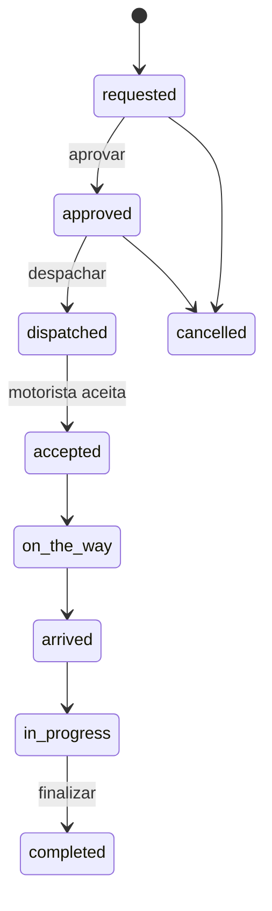

# FSM Flow (Finite State Machine)

## Visão

Duas camadas de estado:

1. **OS / Viagem (`trips.operational_status`)** — ciclo de vida da corrida na operação.
2. **Itens / execução motorista (alvo)** — estados finos de deslocamento e embarque (fase posterior).

Não substituir o enum atual de uma vez; **evoluir por migração e compatibilidade**.

## Estado atual — `trip_operational_status` (Postgres)

Valores no banco (`0001_init.sql`):

| Estado | Uso típico |
|--------|------------|
| `requested` | Cliente/operador solicitou |
| `approved` | Aprovada para despacho |
| `dispatched` | Oferta/despacho enviado |
| `accepted` | Motorista aceitou |
| `on_the_way` | A caminho |
| `arrived` | No local |
| `in_progress` | Em atendimento / trânsito |
| `completed` | Encerrada operacionalmente |
| `cancelled` | Cancelada |
| `rejected` | Recusada |
| `no_show` | No-show |
| `reassigned` | Reatribuída |

Histórico automático: trigger em `trip_status_history` (`0026`).

Transições hoje: validadas nas rotas de API (motorista, despacho, aprovação) — **consolidar em módulo único `src/lib/trips/fsm.ts` é meta da Fase 2**.

## Estado alvo — OS (ordem de serviço)

| Estado alvo | Notas |
|-------------|-------|
| `draft` | Rascunho interno |
| `requested` | ✓ já existe |
| `approved` | ✓ já existe |
| `dispatching` | Pode mapear de `dispatched` / fluxo oferta |
| `scheduled` | Agenda confirmada |
| `in_progress` | ✓ próximo de `in_progress` / `on_the_way` |
| `completed` | ✓ |
| `cancelled` | ✓ |
| `delayed` | **Novo** — atraso sem cancelar |

## Estado alvo — execução motorista (corrida/item)

| Estado alvo | Descrição |
|-------------|-----------|
| `pending` | Aguardando despacho |
| `dispatched` | Notificado |
| `accepted` | Aceite confirmado |
| `heading_to_pickup` | Indo ao embarque |
| `arrived_pickup` | No embarque |
| `boarding_confirmed` | Checklist / embarque OK |
| `in_transit` | Em viagem |
| `arrived_destination` | No destino |
| `completed` | Finalizada |
| `incident` | Ocorrência |
| `cancelled` | Cancelada |

## Regras de transição (alvo — implementação incremental)

| Regra | Fase |
|-------|------|
| Não `completed` sem `boarding_confirmed` | Fase 2 |
| Embarque bloqueado se checklist obrigatório incompleto | Fase 2–3 |
| Aceite bloqueado se documentação motorista vencida | Fase 2 |
| Transições só via API com capability + FSM | Fase 2 |

## Diagrama simplificado (atual → próximo passo)

## O que fazer em cada mudança de FSM

1. Migração SQL se novo valor no enum (ou tabela filha de sub-estado).
2. Atualizar este documento.
3. Função `assertTripTransition(from, to, context)` + testes.
4. Atualizar painéis motorista/despacho apenas quando a API estiver estável.

## Preparado agora / depende de fase

| Item | Status |
|------|--------|
| Enum + histórico DB | Implementado |
| Documento de estados alvo | Este ficheiro |
| Módulo central de transições | Fase 2 |
| Checklist / documentação motorista | Fase 2–3 |
| Sub-FSM embarque (`boarding_confirmed`) | Fase 2+ |

## Riscos mitigados

- Estados “soltos” no frontend → enum Postgres + histórico.
- Retrocesso caro → evolução por alias/mapeamento, não big-bang.
